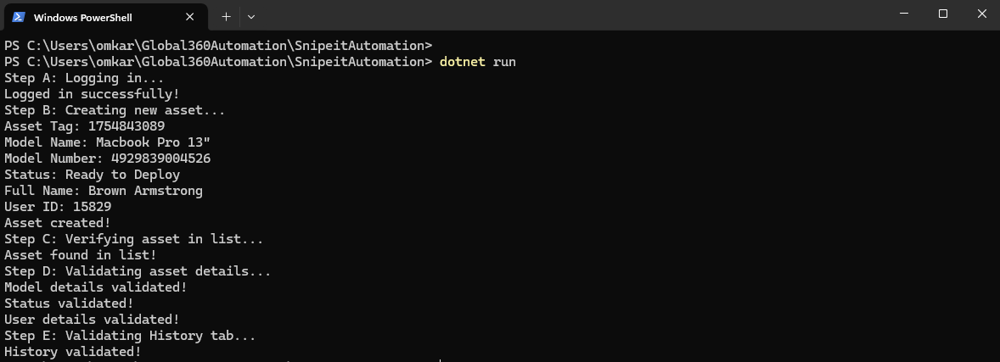

# SnipeIT APP Automation Script (.NET 9.0 + Playwright)

## Description

This project automates asset management tasks on the [SnipeIT demo site](https://demo.snipeitapp.com/login) using **.NET 9.0**, **PowerShell 7.5.2**, and the latest version of **Microsoft Playwright** for browser automation.

The automation script performs these key steps in a single `Program.cs` file, organized from Step A to Step E:

- **Step A:** Login to the SnipeIT demo site as an admin user.
- **Step B:** Create a new **Macbook Pro 13"** asset with status "Ready to Deploy" and assign it to a random user.
- **Step C:** Find the newly created asset in the asset list to verify it was successfully created.
- **Step D:** Navigate to the asset page and validate relevant asset details.
- **Step E:** Validate the details in the **History** tab on the asset page.

### Challenges faced

- Handling dynamic UI elements and selectors that occasionally change or load asynchronously.
- Ensuring the automation script waits efficiently for page elements without relying on fixed delays.
- Managing random user assignment and unique asset naming to avoid duplication on repeated test runs.

---

## Table of Contents

- [Description](#description)
- [Challenges faced](#challenges-faced)
- [Installation](#installation)
- [How to Run](#how-to-run)
- [Output Screenshot](#output-screenshot)
- [Project Structure](#project-structure)
- [Author](#author)

---

## Installation

1. **Prerequisites:**

   - [.NET 9.0 SDK](https://dotnet.microsoft.com/en-us/download/dotnet/9.0)
   - [PowerShell 7.5.2](https://learn.microsoft.com/en-us/powershell/scripting/install/installing-powershell)
   - Git [(to clone the repository)](https://github.com/OhacksS/Global360Automation.git)

2. **Clone the repository:**

   ```bash
   git clone https://github.com/OhacksS/Global360Automation.git
   cd Global360Automation
   ```

3. **Add Playwright package to your project**
   ```bash
   dotnet add package Microsoft.Playwright
   ```
4. **Restore dependencies:**
    ```bash
    dotnet restore
    ```

5. **Install Playwright browsers**
    ```bash
    pwsh bin/Debug/net9.0/playwright.ps1 install
    ```
---

## How to Run

Execute the following command to run the automation script:
  
 ```bash
dotnet run
```

The script will launch a Chromium browser and perform all automation steps, including login, asset creation, verification, and history validation.

---
## Output Screenshot


---
## Project Structure
 ├── Program.cs      # All automation steps (A to E) implemented in this single file<br>
 ├── SnipeitAutomation.cs       # Targets .NET 9.0 and uses Microsoft.Playwright v1.54.0 for browser automation.<br>
 ├── README.md       # Project documentation

--- 
## Author
Omkar Sankpal <br>
Email: omkarsankpal45@gmail.com

---


